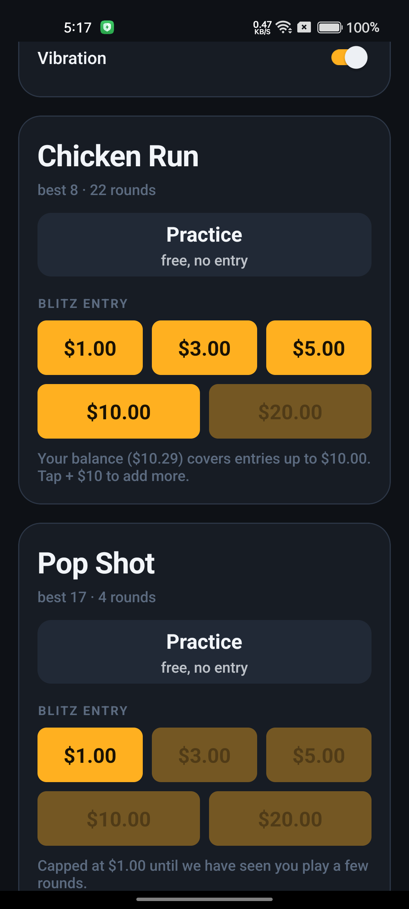
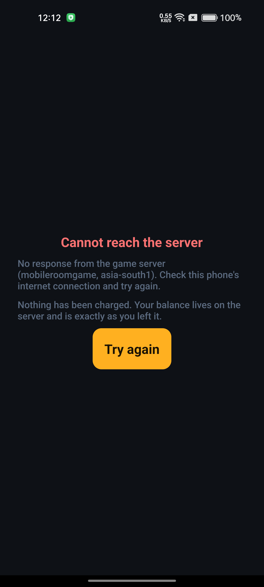
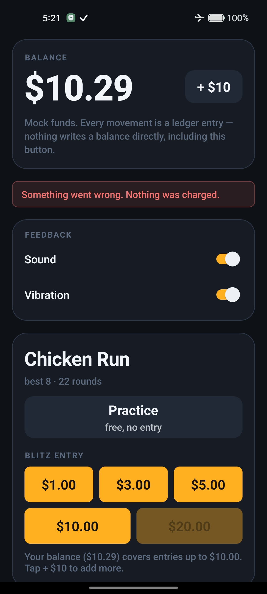

# Chicken Run + Blitz

A Crossy-Road-style mini-game in Unity, wrapped in a real-money solo mode, with a
React Native app in front and a server that does not believe anything the client
tells it.

- **Section 1 — Chicken Run.** Tap to hop forward, swipe to move sideways or back.
  Hold **Cash Out** to bank your score. Get hit by a car, hit by a train, fall in
  the river, or stand still too long, and the round is worth nothing.
- **Section 2 — Blitz.** Pay an entry fee, get shown exactly what each score is
  worth *before* you pay, play one round, get paid against the curve you were
  shown. The score is recomputed on the server by replaying your inputs.

**Platform: Android.** The brief prefers iOS but states that Android is completely
fine and nothing is penalised for choosing it. This was built on Windows with no
macOS host, so iOS was never actually available. See `DECISIONS.md` → D-001.

## Try it — no setup

1. On an Android phone (**Android 7.0+, 64-bit**), download the APK from the
   **[latest release](https://github.com/mj789-98/skill-trial-blitz/releases/latest)** and install it.
2. Open it. It signs in by itself and talks to the **live backend**: Firebase Auth
   and Cloud Functions in `asia-south1`, the database on Supabase. Nothing runs on
   your computer — no Docker, no emulators, no cable.
3. Tap **+ $10** for mock money, pick a stake, play.

New players are capped at a $1 entry and a 1.5× payout for their first rounds —
that is the cold-start protection (D-011), not a bug.

**See it running:** a one-minute [screen recording on a real phone](https://github.com/mj789-98/skill-trial-blitz/releases/download/v1.0.3/screen-recording-v1.0.3.mp4), plus three screens the recording does not reach:

| Not enough balance for a stake | Server unreachable at start-up | A request fails mid-session (airplane mode) |
|---|---|---|
|  |  |  |

---

## Versions

Everything in the brief's pinned table, and what is actually installed.

| Component | Pinned by the brief | Actually used |
| --- | --- | --- |
| Unity Editor | `6000.1.13f1` | `6000.1.13f1` (changeset `418bd0acaa6b`) |
| React Native | `0.86.0` | `0.86.0` |
| React | `19.2.3` | `19.2.3` |
| TypeScript (app) | `^5.8.3` | `5.9.3` |
| Node — RN tooling | `>= 22.11.0` | `22.15.1` |
| Node — Functions runtime | `20` | declared `20`; the emulator runs it on the host's `22.15.1` and says so |
| `firebase-functions` | `^5.0.0` | `5.1.1` |
| `firebase-admin` | `^12.0.0` | `12.7.0` |
| `pg` | `^8.20.0` | `8.23.0` |
| Unity embed | *(deliberately unpinned — record what you used)* | `@azesmway/react-native-unity@1.1.1`, unforked, one patch |

Not in the brief's table but needed to reproduce the build:

| | |
| --- | --- |
| JDK | 17 (Android Studio's bundled JBR `17.0.6`) — **not** the `11.0.16` that may be first on `PATH` |
| Android SDK | platform **36**, build-tools **36.0.0** |
| NDK | the one Unity's Android module installs; do not substitute another |
| Gradle | `9.3.1` (wrapper) |
| Postgres | **17** — required, see below |
| `firebase-tools` | `15.29.0` |
| Docker | for local Postgres only |

**Postgres 17 is not a preference.** The `db.js` supplied with the brief issues
`SET LOCAL transaction_timeout = '30s'` inside every transaction, and
`transaction_timeout` is a PostgreSQL 17 feature. On 15 or 16 that statement
errors and every transaction fails, so testing against an older Postgres would
prove nothing about the code that ships.

---

## Repository layout

```
app/          React Native 0.86 (TypeScript). The only thing that talks to the backend.
  src/api/      the typed client — the one place an endpoint is named
  src/flow/     the round-loop state machine (used instead of React Navigation)
  src/screens/  lobby, payout, round, result
  src/unity/    the embed and the RN<->Unity message contract
unity/        Unity 6000.1.13f1.
  .../Sim/      pure integer simulation — ports line-for-line to JS
  .../View/     rendering and input; owns no rules
functions/    Firebase Functions (JavaScript, per the brief).
  blitz/        quote, enter, heartbeat, submit, sweep
  engine/       target engine and payout curve
  money/        the ledger — the only module that writes a balance
  sim/          the authoritative simulation and the validator registry
sql/          Schema and seed. Applied to local Postgres and to Supabase.
tools/
  sim/          the tuning harness
  e2e/          the round loop driven over HTTPS through a real auth token
docs/         Requirements inventory, tuning report.
```

---

## For developers: running it locally (optional)

**To play, you need none of this.** Install the APK from the
[latest release](https://github.com/mj789-98/skill-trial-blitz/releases/latest):
it talks to the deployed backend (DECISIONS D-031). What follows is for running and
changing the project locally.

Four things run: **Postgres**, the **Firebase emulators**, **Metro**, and the
**app**. The first three are on your development machine; the app is on a device
or emulator.

### 0. Prerequisites

- Node `>= 22.11`
- Docker (for Postgres)
- `firebase-tools` (`npm i -g firebase-tools`) — no login needed, the project ID
  is `demo-skill-trial` and demo projects run fully offline
- Android SDK 36 + build-tools 36.0.0, and **JDK 17**

```bash
git clone https://github.com/mj789-98/skill-trial-blitz
cd skill-trial-blitz
npm --prefix functions install
npm --prefix app install
```

### 1. Database

```bash
docker compose up -d
npm --prefix functions run db:reset
```

`db:reset` drops and recreates the schema, then seeds it. It **refuses to run
against a non-local host** — it is destructive by design and must never be
pointed at Supabase.

The container keeps no volume on purpose: a throwaway database that resets with
the container is what you want for tests.

**Seeding the hosted Supabase instance** is a different operation, because
nothing there is disposable:

```bash
node tools/db/applySeed.js --env .env.supabase --dry-run
node tools/db/applySeed.js --env .env.supabase
```

It applies `sql/002_seed.sql` only — never the schema drop — and prints the
games and config rows before and after, so the change is visible rather than
assumed. The seed is idempotent, so running it against an up-to-date database
is a no-op.

It will not change `games.blitz_enabled`, so that re-seeding can never revert a
toggle someone set on a live game. A database seeded before Pop Shot had a
config of its own therefore keeps Pop Shot's Blitz toggle off until it is turned
on deliberately:

```bash
node tools/db/applySeed.js --env .env.supabase --enable-blitz pop_shot
```

### 2. Backend

```bash
firebase emulators:start --only functions,auth --project demo-skill-trial
```

Emulator UI at <http://127.0.0.1:4000>. Functions on `5001`, Auth on `9099`.

> The scheduled sweeper (`sweepRounds`, every minute) is registered but the
> emulator has no Pub/Sub and never fires it. `sweepNow` is a callable that runs
> the same code, so the abandoned-round path can actually be demonstrated.

### 3. The app

```bash
npm --prefix app start          # Metro
npm --prefix app run android    # build and install
```

**On a physical device**, nothing else is needed for a debug build: the app finds
the backend by reading the host out of Metro's bundle URL, which is by definition
a machine address the device can already reach. `10.0.2.2`, `localhost` and a LAN
IP are each correct in different places and hard-coding any one of them breaks
the other two — see `app/src/api/config.ts`.

### 3b. The prebuilt release APK

**Download it: the [latest release](https://github.com/mj789-98/skill-trial-blitz/releases/latest).** Android 7.0+ on a 64-bit phone, and an internet connection. Nothing else.

`app/android/app/build/outputs/apk/release/app-release.apk`, arm64-v8a, signed
with the standard Android debug key so it installs without you generating one.

**A release build talks to the deployed backend, not to your machine:** Firebase
project `mobileroomgame`, functions in `asia-south1`, the database on Supabase in
`ap-south-1`. Install it on any phone with an internet connection and it works —
no cable, no emulators, no address to type. Why it is built that way, and what it
took, is in DECISIONS D-031.

```bash
adb install -r app-release.apk
```

**To aim a release build at your local emulators instead** — to play against the
seeded local database, say — set `FORCE_BACKEND = 'emulator'` in
`app/src/api/config.ts` and rebuild. That build has no Metro to ask, so it looks
for the backend on `localhost`, which you point at your machine over the cable:

```bash
adb reverse tcp:5001 tcp:5001
adb reverse tcp:9099 tcp:9099
```

That works on a physical device and an emulator alike, needs no IP address and
no firewall change.

**Or set the address in the app, with no cable and no rebuild** (emulator builds
only — a cloud build has one server and does not offer the field). If the backend
is on another machine — or you simply do not want to be tethered — install the
APK, open it, and wait. With nothing to talk to, the app stops after twelve
seconds and offers a field:

> **Cannot reach the server**
> No response from the backend at localhost (via adb reverse over USB)…
> If the backend is on another machine, enter its address:

Type the host machine's LAN address (`ipconfig` / `ifconfig` — the Wi-Fi one,
e.g. `192.168.1.20`), tap **Save address**, then close the app completely and
reopen it. The address is remembered. A restart is needed because the Firebase
SDK is pointed at its backend once, when it is created, and there is no
supported way to re-point a live instance.

Both machines must be on the same network, and ports 5001 and 9099 must be
reachable — the emulators already bind `0.0.0.0` (see `firebase.json`), so on
most setups it just works.

To go back to USB, clear the field and save.

### 4. Test account

Sign-in is automatic — the app signs in as the seeded player on first launch, so
a clean install lands in the lobby rather than on a form. If you want the
credentials:

| | |
| --- | --- |
| email | `player@skilltrial.test` |
| password | `blitz-trial-2026` |

That password is in the repo deliberately: the alternative — a credential that
has to be sent separately — makes "install and play" impossible. In an emulator
build it authenticates against the Auth emulator on your machine.

In a release build it is a real account on `mobileroomgame`, shared by every
install — which means anyone who reads this could change its password. Nothing
is exposed that way (the money is fake, and every call acts only on the caller's
own uid), but it would lock every other install out at once. So if the shared
account ever stops working, the app falls back to an anonymous account for that
install instead of failing. See D-031.

The account starts empty. **+ $10** in the lobby is a mock deposit; it still goes
through the ledger like every other movement, because even fake money leaves an
auditable row.

### 5. Deploying the backend (project owner only)

Reviewers never need this — the release APK already points at the deployed
project. It is here so the deployment is reproducible rather than remembered.

1. The project must be on the **Blaze** plan. Cloud Functions and Secret Manager
   cannot be enabled on the free plan.
2. **Authentication → Get started**, then enable **Email/Password** (the shared
   test account) and **Anonymous** (its fallback).
3. Store the database password as a secret. It prompts for the value; it is never
   written to a second file:

   ```bash
   firebase functions:secrets:set SUPABASE_PG_PASSWORD --project mobileroomgame
   ```

4. `functions/.env.mobileroomgame` holds the four non-secret connection keys —
   `PG_HOST`, `PG_PORT`, `PG_DATABASE`, `PG_USER` — and is gitignored.
5. Deploy, then bring the hosted database's configs up to date:

   ```bash
   firebase deploy --only functions --project mobileroomgame
   node tools/db/applySeed.js --env .env.supabase
   ```

---

## Tests

| | command | count |
| --- | --- | --- |
| Backend — unit + integration | `npm --prefix functions test` | **127** |
| App — reducer + formatting | `npm --prefix app test` | **18** |
| End to end, through a real auth token | `npm --prefix functions run test:e2e` | **16 checks** |
| Generated audio, measured | `SkillApp/Export Audio Preview` in Unity | **8 clips** |

The backend suite needs Postgres up (step 1). The e2e script needs Postgres *and*
the emulators (steps 1–2); it is a script rather than a test file on purpose,
because a suite that goes red when a service is not running teaches people to
ignore red.

What the e2e script covers that nothing else can: every other test calls the
modules directly and therefore passes a `playerId` in as an argument. This drives
the loop over HTTPS and checks that the uid actually arrives from a **verified
token** — and that a `playerId` in the request body buys an attacker nothing.

---

## The tuning harness

```bash
node tools/sim/run.js                                          # the live config
node tools/sim/run.js --sweep curve.cap_multiplier=2.5,3.0,3.5 # numbers either side
node tools/sim/run.js --compare baseline-v0,tuned-v1           # before and after
```

2,100 synthetic players across seven archetypes, each a *hand* and a
*temperament* — because a Blitz score is `min(how far they get, where they chose
to stop)`, and zero if they died first, so cash-out discipline drives the payout
distribution as much as reflexes do.

It calls the shipping code (`buildQuote`, `materialiseCurve`,
`multiplierBpForScore`, `payoutCents`, `advanceProfile`) rather than a model of
it, and `advanceProfile` runs inside every simulated career — so what is measured
is the closed loop, not a fixed paytable. One seeded PRNG, so every number is
reproducible.

**Shipped config: `tuned-v1`, RTP 86.4%**, win rate 40.6%, bust rate 13.2%.
Latest run and the numbers either side: [`docs/tuning-report.md`](docs/tuning-report.md).
Why 86.4% and not 88%: `DECISIONS.md` → D-012.

---

## Where things stand

Honest status per requirement is in [`docs/REQUIREMENTS.md`](docs/REQUIREMENTS.md),
which is the source of truth. Judgement calls, the threat model, scope cuts, and
where AI was and was not used are in [`DECISIONS.md`](DECISIONS.md).

**Pop Shot (Section 3), the bonus game, is built** — at the reviewer's direction;
why, and what it taught the payout engine, is in D-018 and D-025.

**The backend is deployed** (D-031), and the downloadable APK talks to it. The
local setup above is for changing the project, not for playing it.
